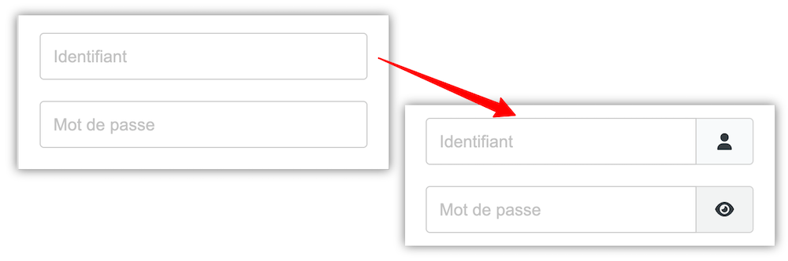

# CF-Password-UI-UX

## Convert Forms, modernize Username and Password fields

### Intro

In the **Convert Forms** application, we have a "password" type field that doesn't differ from a classic text field and doesn't offer the ability to temporarily display the input to check that an incorrect password hasn't been typed.

### To Do

Since Joomla offers this by default on its login form, we can use its classes to modify the behavior of the "**Password**" field and style a text type field "**Username**" by adding representative icons to them.

To get the functionality of login and password fields, you need to modify the text field provided by Convert Forms.
Tassos, the extension's developer, indicates how to override the application's different fields in [his documentation](https://www.tassos.gr/docs/convert-forms/developers/override-form-ands-layouts-in-your-template#override_a_field_layout).

### Implementation [^1]

We will override the **TEXT** type field to add functions for the targeted fields.

Go to the original file at the path **/administrator/components/com\_convertforms/layouts/fields/** and copy the **text.php** file.

Then go to your template's override directory at the path **/templates/YOUR\_TEMPLATE/html/layouts/com\_convertforms/fields/** (if the directories don't exist, you'll need to create them) and paste the copied file there.

You then need to modify the file. You can do this with any editor, or more simply in your administration, access the menu link **Extensions - Templates - Templates** - click on your template, then open the **html/layouts/com\_convertforms/fields/** tree and select the **text.php** file to display its code in the editor.

At the very end of the file, after line 63, enter the following code snippet:

```php
<?php if ($field->type === 'password'): ?>
    <button type="button" class="btn btn-secondary cf-btn input-password-toggle" role="switch" aria-checked="false">
        <span class="icon-eye icon-fw" aria-hidden="true"></span>
        <span class="visually-hidden">Afficher le mot de passe</span>
    </button>
<?php endif; ?>
<?php if (isset($field->class) && strpos($field->class, 'username') !== false): ?>
    <span class="input-group-text" title="Identifiant" style="justify-content:center;">
    <span class="icon-user icon-fw" aria-hidden="true"></span>
    </span> 
<?php endif; ?>
```

Save these changes and close the file.

This code snippet checks if the field is of type **password** or of type text with the **username** class (which we will then need to indicate in the parameters of the "**Username**" form field).

If you have prepared a form and it can be displayed on the frontend, you can see that the password type field has been modified, but it doesn't look at all like what was expected.
Indeed, the eye icon has been integrated, but it is located below the password. You will need to add some **CSS style** to get the expected rendering.
In the case of a "Username" field to which you have added a "username" class, the icon's behavior will be similar to that of the password, but it will have no other function than visual rendering.

-----

In your template's file structure, you will need a custom CSS file that cannot be overwritten during the next template update. Depending on your template, this file should be named "**user.css**" or "**custom.css**" (check your template's documentation).

In this file, you will add the following CSS code:

```css
/* format Password / Username + Button */

.convertforms div[data-type="password"] div.cf-control-input,
.convertforms div[data-name="username"] div.cf-control-input {
    flex-direction: row;
    gap:0;
    flex-wrap:wrap;
}
.convertforms div[data-type="password"] input[type="password"], .convertforms div[data-type="password"] input[type="text"],
.convertforms div[data-name="username"] input {
    border-top-right-radius:0;
    border-bottom-right-radius:0;
    width:calc(100% - 54px);
}

.convertforms div[data-type="password"] button,
.convertforms div[data-name="username"] input + span {
    width:54px;
    background:#f9fafb;
    border: 1px solid lightgrey !important;
    border-radius:.25rem; /* adaptez à votre formulaire en cas de besoin */
    border-top-left-radius:0 !important;
    border-bottom-left-radius:0 !important;
    border-left:none !important;
    padding: .6rem 1rem !important;
    color: #353B41 !important;
}

/* gère la description si elle est utilisée et selon son emmplacement, avant ou après le champ */
.convertforms div[data-type="password"] button + div.cf-control-input-desc,
.convertforms div[data-name="username"] button + div.cf-control-input-desc {
    margin-top:10px;
}

.convertforms div[data-type="password"] div.cf-control-input > div.cf-control-input-desc,
.convertforms div[data-type="username"] div.cf-control-input > div.cf-control-input-desc {
  width: 100%;
  margin-bottom:10px;
}
/*////////////////////////////////*/
```

After adding this, save your file [^2], clear the caches, and now observe the fields of your form after refreshing the page [^3].

Enter a few characters in the password field and click the eye icon to see the input in text mode. Click the crossed-out eye icon to return to the hashed "Password" state.

To get the username icon for the corresponding field, it's important to give it the **input CSS class** "**username**" when editing this text type field.

If you want to achieve the identical visual appearance in the administration when editing a form, you will need to repeat the operations described above for the Atum administration template.

-----

[^1]:
    The files needed for this adaptation are available for download; they should be placed according to the unzipped directory structure.

[^2]:
    If you use this type of field on only one form, it is certainly possible to insert the CSS in the form options - Menu **Appearance** - **Advanced** tab - **Custom CSS**.

[^3]:
    For this example, the TWO template from Astroid was used. You may need to adapt the CSS slightly depending on your template.
